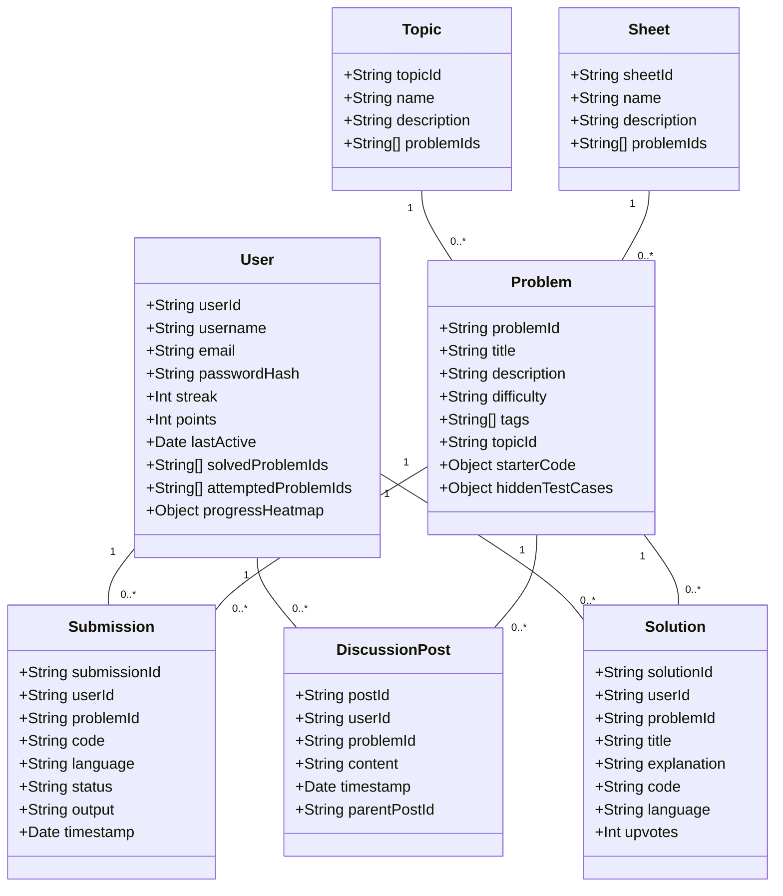
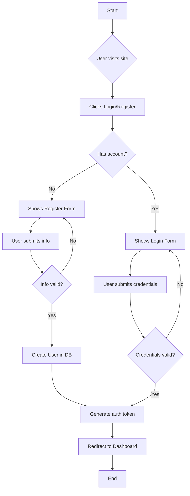
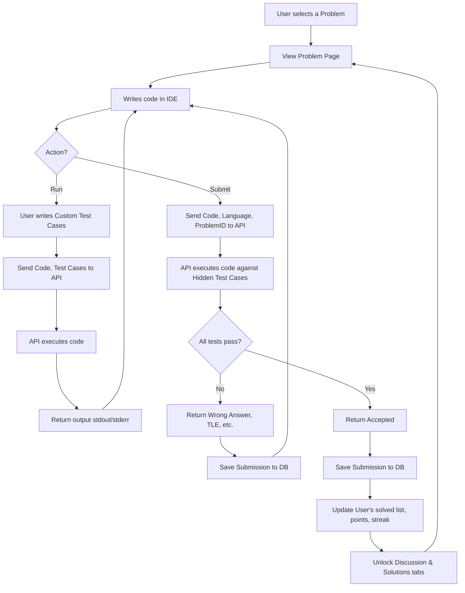

# Structure Solver - Project Plan & Documentation

## 📋 Table of Contents
- [Project Overview](#project-overview)
- [Core Features](#core-features)
- [Development Phases](#development-phases)
- [Database Schema](#database-schema)
- [User Flows](#user-flows)
- [Tech Stack](#tech-stack)
- [Getting Started](#getting-started)

## 🚀 Project Overview

**Structure Solver** is a comprehensive, MERN-stack-based web platform designed to be a one-stop solution for learning, practicing, and mastering Data Structures and Algorithms (DSA). It combines educational content, a full-featured online IDE, personalized user dashboards, and community engagement features to guide users from beginner to interview-ready.

### Tech Stack
- **Frontend**: React (with JSX), TailwindCSS
- **Backend**: Node.js, Express.js
- **Database**: MongoDB
- **Code Execution**: Secure third-party API (e.g., Judge0)

## 🎯 Core Features

### A. Learning & Content
- **DSA Topic Pages**: Detailed articles with explanations, pseudo-code, and practice problems
- **DSA Practice Sheets**: Curated problem lists (e.g., "SDE Sheet," "Blind 75")
- **Learning Roadmaps**: Guided paths for different goals
- **Company-Specific Tracks**: Practice sheets targeting top tech companies
- **Embedded Video Explanations**: Video content on problem pages
- **Interactive Visualizers**: JavaScript-based algorithm animations

### B. The Online IDE & Practice
- **In-Built Code Editor**: Multi-language support (C++, Java, Python, JavaScript)
- **Secure Code Execution**: Sandboxed environment via third-party API
- **Custom Test Cases**: User-defined test cases for debugging
- **Submission & Judging**: Automated test case evaluation
- **Submission History**: Track all past attempts and results

### C. User Dashboard & Gamification
- **User Authentication**: Secure registration and login
- **Personalized Dashboard**: Key stats and progress tracking
- **Daily Streak System**: Consecutive day counter with visual calendar
- **Ranking & Leaderboard**: Global ranking based on performance
- **Progress Visualization**: GitHub-style heatmap or skill tree
- **DSA Tests**: Timed problem-solving assessments
- **Hints System**: Point-based hint unlocking

### D. Community & Social
- **Discussion Boards**: Problem-specific forums
- **Solution Sharing**: User-submitted solutions with voting
- **Public Profiles**: Shareable user statistics and achievements
- **Mock Interviews**: Shared IDE with video/audio chat via WebRTC

## 🗓️ Development Phases

### Phase 1: The Core Content & Foundation (MVP)
**Goal**: Build a non-interactive "knowledge base" and establish core architecture
- User Authentication (Login/Signup)
- Database Schemas: User, Problem, Topic, Sheet
- Admin Interface for content management
- Basic Topic, Sheet, and Problem pages
- Manual progress tracking ("Mark as Complete")

### Phase 2: The Interactive IDE
**Goal**: Enable interactive problem solving
- Code editor integration (Monaco/CodeMirror)
- Code execution API integration (Judge0)
- Custom test case execution
- Automated submission judging
- Submission history tracking

### Phase 3: Gamification & Engagement
**Goal**: Build user retention features
- Daily streak system implementation
- Ranking and leaderboard system
- Progress visualization (heatmaps)
- DSA test/assignment feature
- Hints system with points

### Phase 4: Community & Advanced Features
**Goal**: Create collaborative ecosystem
- Per-problem discussion boards
- Solution sharing with voting
- Public user profiles
- Mock interview feature (shared editor + WebRTC)
- Interactive algorithm visualizers

## 🗄️ Database Schema



## 🔄 User Flows

### User Registration & Login


### Problem Solving Workflow


### Mock Interview Flow
```mermaid
flowchart TD
    A[User A navigates to Mock Interview page] --> B[Clicks "Create Session"];
    B --> C[Generate unique session link];
    C --> D[User A shares link with User B];
    D --> E[User B joins link];
    E --> F[Both users connected via WebRTC];
    F --> G[Shared IDE is loaded];
    G --> H[User A Interviewer picks a problem];
    H --> I[User B Interviewee codes solution];
    I --> J{Session ends};
    J --> K[Both users disconnect];
```

## 🛠️ Getting Started

### Prerequisites
- Node.js (v14 or higher)
- MongoDB
- npm or yarn

### Installation
```bash
# Clone the repository
git clone https://github.com/your-username/structure-solver.git

# Install backend dependencies
cd backend
npm install

# Install frontend dependencies
cd ../frontend
npm install
```

### Environment Setup
Create `.env` files in both backend and frontend directories with appropriate configuration variables.

### Development
```bash
# Start backend server
cd backend
npm run dev

# Start frontend development server
cd frontend
npm start
```

## 📞 Contact & Support

For questions, suggestions, or contributions, please contact the development team or create an issue in the repository.

---